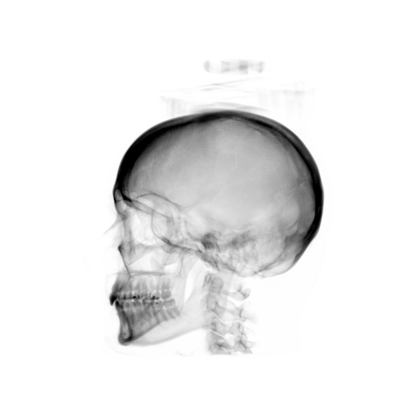
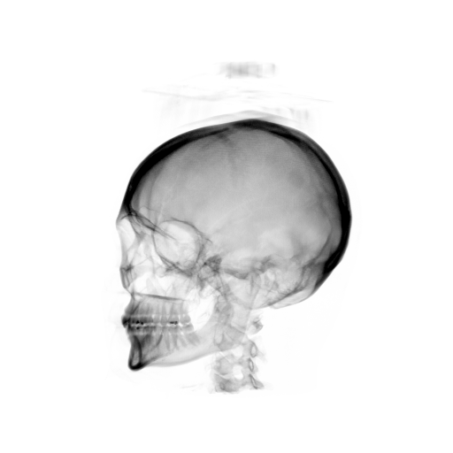
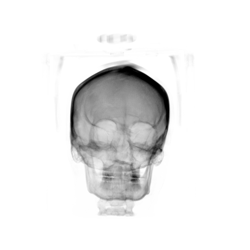
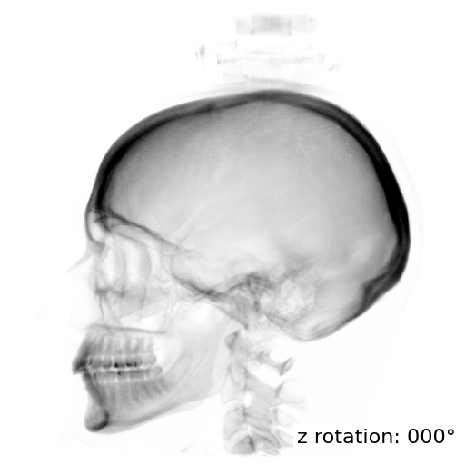

# python-drr

Python DRR renderer using a Siddon/Jacobs-style projector.

<p align="center">
  
  
  
  
</p>

## Basic Usage

Single lateral-like DRR:

```bash
(python39) [user@machine python-drr]$ python get_drr_siddon_jacobs.py --help
usage: get_drr_siddon_jacobs.py [-h] [-v] [-res ROW_MM COL_MM] [-size H W] [-scd SCD] [-t TX TY TZ] [-rx RX] [-ry RY] [-rz RZ] [-2dcx COL ROW] [-iso IX IY IZ] [-rp RP] [-threshold THRESHOLD] -o OUTPUT [--invert] [--no-clamp-negative]
                                [--p-lo P_LO] [--p-hi P_HI] [--n-cores N_CORES] [--mp-chunksize MP_CHUNKSIZE]
                                input

Calculate a Digitally Reconstructed Radiograph from a CT/CBCT image using a Siddon/Jacobs-style ray-tracing projector.

positional arguments:
  input                 Input 3D image filename readable by SimpleITK

optional arguments:
  -h, --help            show this help message and exit
  -v, --verbose         Verbose output (default: False)
  -res ROW_MM COL_MM    DRR pixel spacing in the isocenter plane in mm (default: (0.51, 0.51))
  -size H W             DRR size in pixels (default: (512, 512))
  -scd SCD              Source to isocenter distance in mm (default: 1000.0)
  -t TX TY TZ           Volume translation in x, y, z in mm (default: (0.0, 0.0, 0.0))
  -rx RX                Volume rotation about x axis in degrees (default: 0.0)
  -ry RY                Volume rotation about y axis in degrees (default: 0.0)
  -rz RZ                Volume rotation about z axis in degrees (default: 0.0)
  -2dcx COL ROW         Central axis detector position in continuous pixel indices (col row) (default: None)
  -iso IX IY IZ         CT isocenter in continuous voxel indices (x y z) (default: None)
  -rp RP                Projection angle in degrees (default: 0.0)
  -threshold THRESHOLD  Ignore CT values below this threshold (default: 0.0)
  -o OUTPUT, --output OUTPUT
                        Output image filename (default: None)
  --invert              Invert grayscale when saving display-oriented formats like PNG (default: False)
  --no-clamp-negative   Do not clamp negative intensities to zero above the threshold (default: False)
  --p-lo P_LO           Lower percentile for PNG-style normalization (default: 1.0)
  --p-hi P_HI           Upper percentile for PNG-style normalization (default: 99.5)
  --n-cores N_CORES     Number of CPU cores/processes for parallel rendering. Omit for serial rendering. (default: None)
  --mp-chunksize MP_CHUNKSIZE
                        Row chunksize for multiprocessing work scheduling in drr.renderer. (default: 1)
```

## Requirements

Python packages:

```text
- numpy
- SimpleITK
- tqdm
- scipy
- imageio
```

## Notes

- assumes the volume is axis-aligned
- SimpleITK direction matrix is currently ignored
- `-res` is interpreted as spacing at the **isocenter plane**
- supports multiprocessing with `--n-cores`
- rotations/translations are applied to the **volume**
- `--invert` only changes saved display appearance for formats like PNG
- rendering cost scales with detector size (`-size`) and smaller spacing (`-res`)
- `-threshold` and negative clamping affect background / air contribution

## Acknowledgement

ChatGPT (GPT-5.4 Thinking, web interface) and Codex were used to assist with coding, debugging, and documentation for this project.